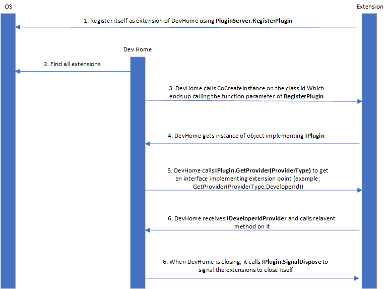

# Extensions

Dev Home is an app extension host which utilizes [out-of-process COM](https://learn.microsoft.com/en-us/samples/dotnet/samples/out-of-process-com-server/) to talk to external COM Server processes that declare themselves to be an extension of Dev Home.

Dev Home currently supports extending 2 interfaces though the Extension SDK. In addition, the extension can also provide widgets to Dev Home using [Widget providers](https://learn.microsoft.com/en-us/windows/apps/develop/widgets/widget-providers).

## Extension basics

Each extension lives as a separate, packaged windows application and manages it's own lifecycle. The extension applications declare themselves to be an extension of Dev Home through the [manifest file](#extension-manifest).

An extension can provide functionality for one or more extensibility point. Currently, Dev Home supports two extensibility points:

- Developer Id related scenarios: Allowing developers to sign in and sign out of a service. Extensions can implement this functionality by implementing the [IDeveloperIdProvider interface](#ideveloperidprovider)
  
- Repository related scenarios: Allowing developers to get available repositories in their account or parse repositories from urls and clone them. Extensions can implement this functionality by implementing the [IRepositoryProvider interface](#irepositoryprovider)

Read more about [Provider interfaces here](#provider-interfaces). Each extension also must have a class that implements IPlugin. DevHome would try to create an instance of this class. The GUID of this class must be reflected in the manifest. See [sample plugin](../SamplePlugin/SamplePlugin.cs)


## Extension manifest

The package.appxmanifest file must define a Com Server (which includes the class Id of the Plugin class) and AppExtension properties declaring extension information.

```xml
<Extensions>
  ...
  <com:Extension Category="windows.comServer">
    <com:ComServer>
      <com:ExeServer Executable="ExtensionName.exe" Arguments="-RegisterProcessAsComServer" DisplayName="Sample Extension">
        <com:Class Id="<Plugin Class GUID>" DisplayName="Sample Plugin" />
      </com:ExeServer>
    </com:ComServer>
  </com:Extension>

  <uap3:AppExtension Name="com.microsoft.devhome" Id="YourApplicationUniqueId" PublicFolder="Public" DisplayName="Sample Extension" Description="This is a sample description.">
    <uap3:Properties>
      <DevHomeProvider>
        <Activation>
          <CreateInstance ClassId="<Plugin Class GUID>" />
        </Activation>
        <SupportedInterfaces>
          <DeveloperId />
          <Repository />
        </SupportedInterfaces>
      </DevHomeProvider>
    </uap3:Properties>
  </uap3:AppExtension>
</Extensions>
```

## Provider Interfaces

### IDeveloperIdProvider

Developer Id related scenarios can be extended by:
- Implementing the IDeveloperIdProviderInterface
- In the manifest, declaring DeveloperId as one of the supported interfaces

```cs
public interface IDeveloperIdProvider : global::System.IDisposable
{
  string GetName();
  global::System.Collections.Generic.IEnumerable<IDeveloperId> GetLoggedInDeveloperIds();
  global::Windows.Foundation.IAsyncOperation<IDeveloperId> LoginNewDeveloperIdAsync();
  void LogoutDeveloperId(IDeveloperId developerId);
  IExtensionAdaptiveCardSession GetLoginAdaptiveCardSession();
  event global::System.EventHandler<IDeveloperId> LoggedIn;
  event global::System.EventHandler<IDeveloperId> LoggedOut;
  event global::System.EventHandler<IDeveloperId> Updated;
}
```

```cs
public interface IDeveloperId
{
  string LoginId();
  string Url();
}
```
### IRepositoryProvider

Repository related scenarios can be extended by:
- Implementing the IRepositoryProvider interface
- In the manifest, declaring DeveloperId as one of the supported interfaces

```cs
public interface IRepositoryProvider : global::System.IDisposable
{
  global::Windows.Foundation.IAsyncOperation<global::System.Collections.Generic.IEnumerable<IRepository>> GetRepositoriesAsync(IDeveloperId developerId);
  
  global::Windows.Foundation.IAsyncOperation<IRepository> ParseRepositoryFromUrlAsync(global::System.Uri uri);
  
  string DisplayName { get; }
}
```

```cs
public interface IRepository
{
  [global::Windows.Foundation.Metadata.Overload(@"CloneRepositoryAsync")]
  global::Windows.Foundation.IAsyncAction CloneRepositoryAsync(string cloneDestination, IDeveloperId developerId);

  [global::Windows.Foundation.Metadata.Overload(@"CloneRepositoryAsync2")]
  global::Windows.Foundation.IAsyncAction CloneRepositoryAsync(string cloneDestination);
  
  string DisplayName { get; }
  
  bool IsPrivate { get; }
  
  global::System.DateTimeOffset LastUpdated { get; }
  
  string OwningAccountName { get; }
}
```


## Sequence diagram



## Runtime logic

At startup, Dev Home iterates the app catalog for any extensions and adds them to a dictionary.
```cs
private readonly IDictionary<string, IReadOnlyList<AppExtension>> _extensions = new Dictionary<string, IReadOnlyList<AppExtension>>();
```

Any internal tools can retrieve a readonly list of extensions for a given extension point via:
```cs
var extensionService = App.GetService<IExtensionService>();
var extensions = extensionService.GetExtensions("widget");
```
